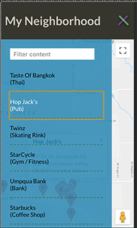
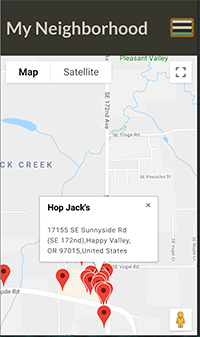
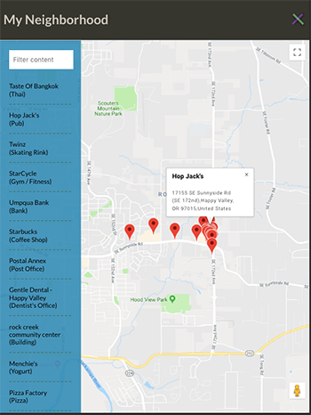
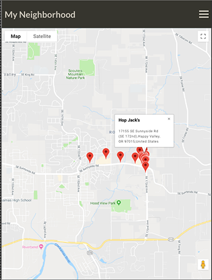
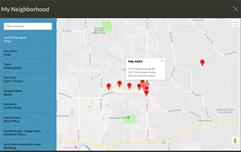
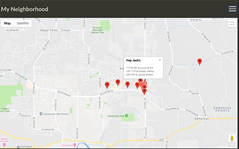

# My Reads App
##### Project for the *Front-End Web Developer Nanodegree*

#### Introduction

**Title**: My Neighborhood

by Rebecca Hanlon

*My Neighborhood*  uses the users current position to find business and government offices near the user.  If a user is looking for a specific location he or she can enter the name into the filter input to sort or search for a specific venue that has been sent.  A user can click each marker for more details or click each venue in the sidebar draw list for more details.

<!--Click [here](#picture-of-data-and-components-breakdown) to see the component and data break down of the app.-->

Click [here](#pictures-of-responsive-design) to see pictures of the website's Responsive Design.

<br>

<hr>

##### Start-up Server

To run the server, NPM or Yarn must be installed.

Open up the terminal and go to the project directory.  Inside of the project directory, run:

`npm install`

`npm start`

If you have Yarn installed run:

`yarn start`

This project was built using *Create React App*.  For complete technical details click [Create React App](./docs/README.md)


##### Technical Components
- CSS Grid, Flexbox and Media Queries used to build the _responsive features_.
- Accessibility features built using semantic tags and appropriate properties such as Aria-labels and tabIndex
- JavaScript (ECMASript 6)
- React 16.5.2
    - PropTypes
- Google Maps JavaScript API
    - [Overview](https://developers.google.com/maps/documentation/javascript/tutorial) :
      Gave an overview of how to get a map to show up.  ToC of additional topics and concepts to use to customize map.
    - [Geocoding Service](https://developers.google.com/maps/documentation/javascript/geocoding) :
      Gave an overview to enable the Geocoding API, sample of the result.
    -  [Markers](https://developers.google.com/maps/documentation/javascript/markers) : Overview of how to add and remove a marker, animate a marker, customize a marker, etc.
- FourSquare API
    - [Places API](https://developer.foursquare.com/docs/announcements)
    - [Get Details of a Venue](https://developer.foursquare.com/docs/api/venues/details)


##### Articles and Tutorials
**notes**:

Used the following tutorials, articles and docs while building this app.

- *Coding Session - Google Maps with React JS* by Ryan Waite, [video](https://www.youtube.com/watch?v=5J6fs_BlVC0&feature=youtu.be)
I used this tutorial to set up Google Maps in React and filter input.  Also see StackOverFlow answer below

- *Modal Dialogs in React* by Dave Ceddia [article](https://daveceddia.com/open-modal-in-react/)
Used this tutorial for the modal window--SideBarDrawer

- *Using Google Maps in React Component* at [StackOverFlow answer by tremby](https://stackoverflow.com/questions/48493960/using-google-map-in-react-component)

- *ReactJS - get latitude on click and show it in input* [StackOverFlow answer by mersocarlin](https://stackoverflow.com/questions/46387375/reactjs-get-latitude-on-click-and-show-it-in-input)
My component is different but this article reminded me about 'state'.

- The following lessons from the FEND-NanoDegree course:
    - Lesson 5: Getting Started with the APIs
    - Lesson 6: Understanding API Services

- React Docs
    - [The Select Tab](https://reactjs.org/docs/forms.html#the-select-tag)
    - [Handling Events](https://reactjs.org/docs/handling-events.html)
    - [DOM Elements](https://reactjs.org/docs/dom-elements.html)
    - [Typechecking With PropTypes](https://reactjs.org/docs/typechecking-with-proptypes.html)
    - [Accessibility](https://reactjs.org/docs/accessibility.html)

- How to deal with the state being one step behind, [StackOverFlow](https://stackoverflow.com/questions/42434013/react-state-update-step-behind) answered by paquash

- *Tutorial Requests: FEND Project 7 - Walk Through & Complete Guide(Long)* by Ryan Waite, [video](https://www.youtube.com/watch?v=LvQe7xrUh7I&list=PLKC17wty6rS1XVZbRlWjYU0WVsIoJyO3s&index=9)

- FourSquare Docs
    - [Docs Overview](https://developer.foursquare.com/docs)
    - [Search for Venues](https://developer.foursquare.com/docs/api/venues/search)

- w3schools
    - [HTML5 Geolocation](https://www.w3schools.com/html/html5_geolocation.asp)

- MDN Web Docs
    - [Promise.all()](https://developer.mozilla.org/en-US/docs/Web/JavaScript/Reference/Global_Objects/Promise/all)

##### Folder Structure Breakdown
```
    my-reads_app/
      docs/
        imgs/
        rubric-notes
        README.md(React)
      node_modules/
      package.json
      public/
        index.html
        favicon.ico
        manifest.json
        sw.js
      src/
        components/
           App/
             App.css
             App.js
           HamburgerIcon/
             HamburgerIcon.js
             HamburgerIcon.css
           SearchBar/
             SearchBar.js
             SearchBar.css
           SideBarDrawer/
             SideBarDrawer.js
             SideBarDrawer.css
           SideBarList/
             SideBarList.js
             SideBarList.css
           Utils/
             Utils.js
             Utils.css
           startServiceWorker.js
        App.test.js
        index.css
        index.js
        logo.svg
      README.md
      gitignore
      yarn.lock
      package.json
      package-lock.json
```

<!--#### Picture of Data and Components Breakdown-->
<!---->

#### Pictures of Responsive Design
##### Phone





##### Tablet




##### Desk Top



